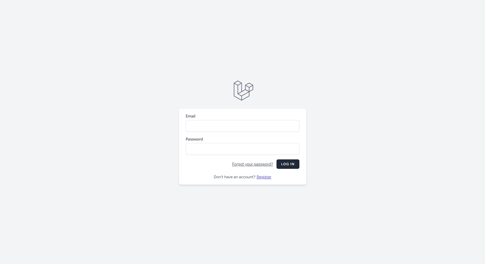
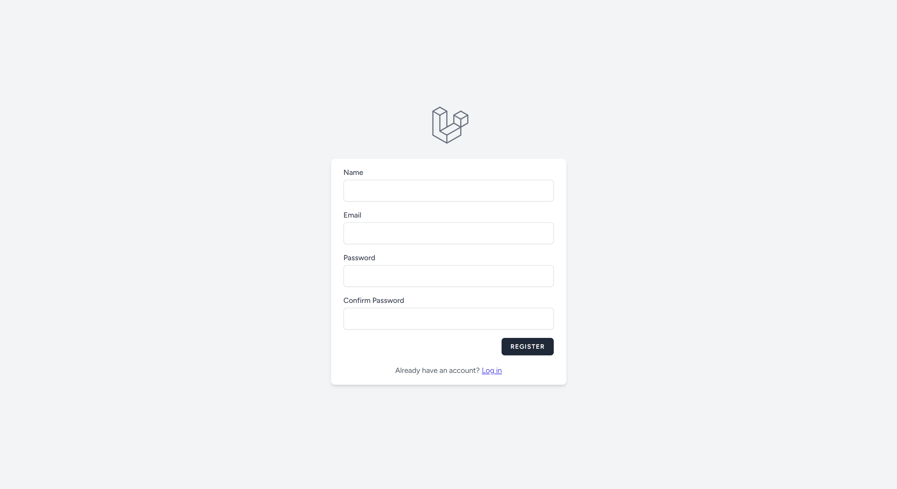
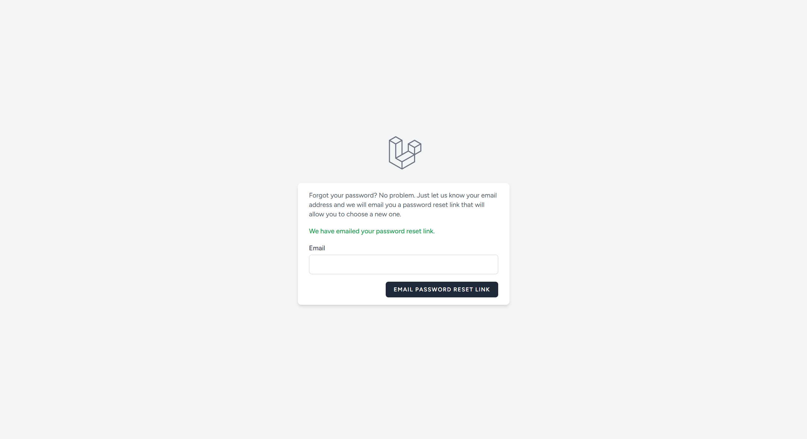
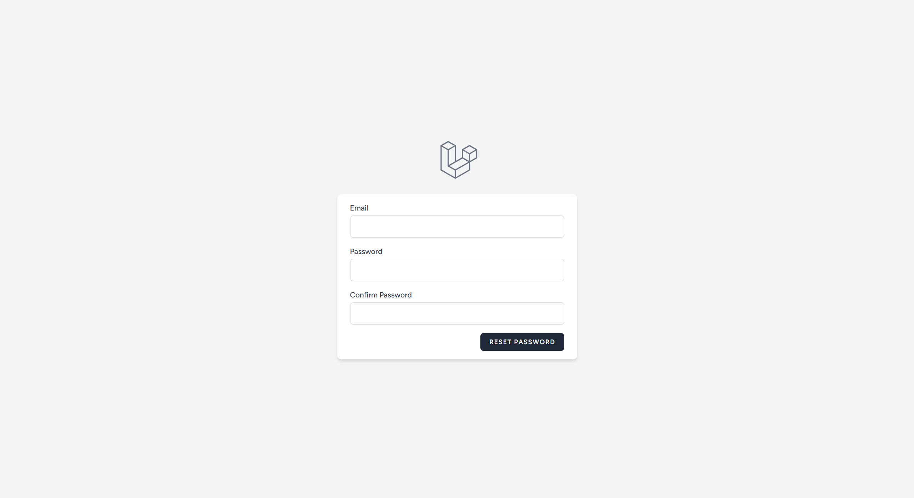
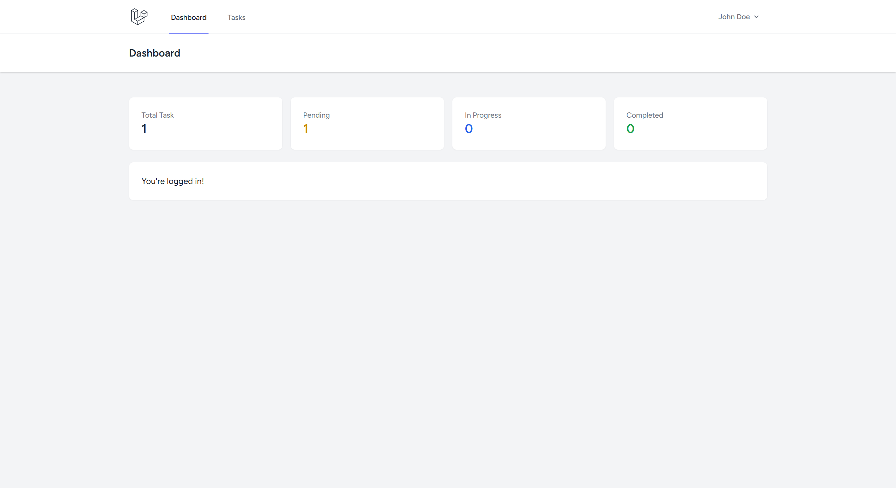
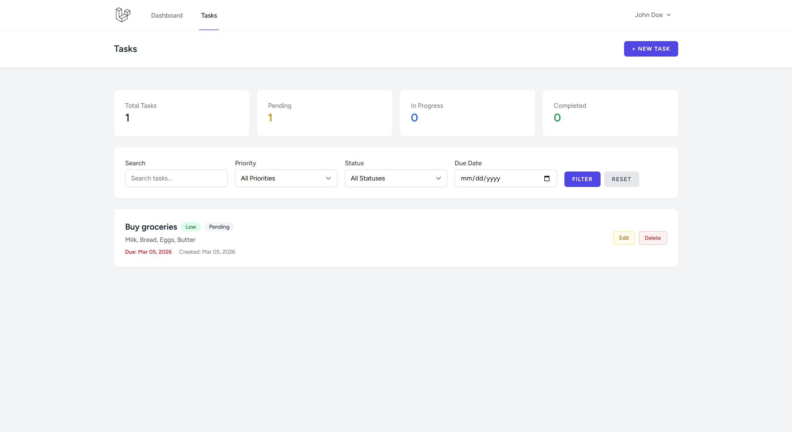
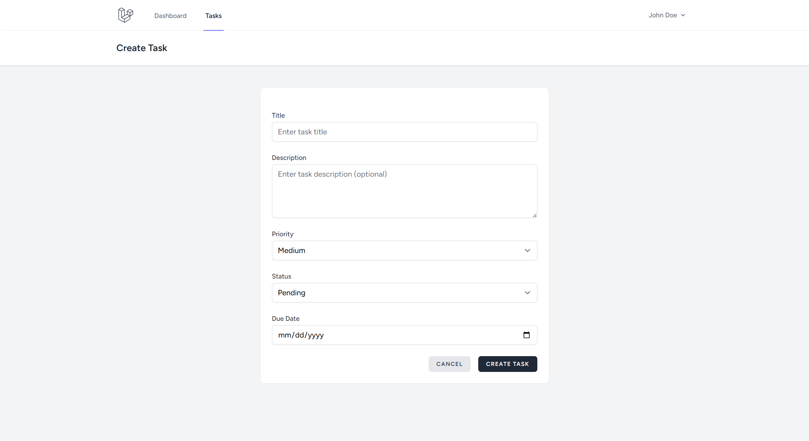
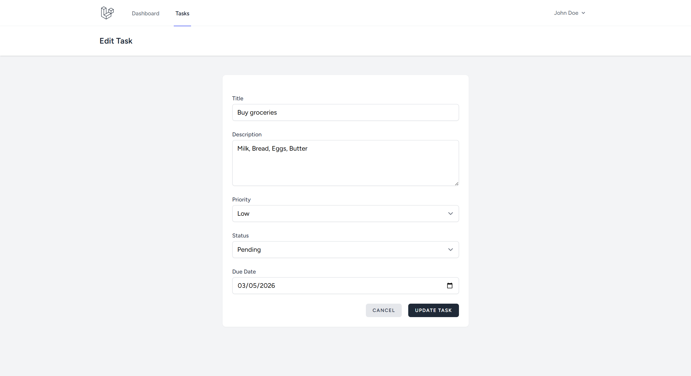
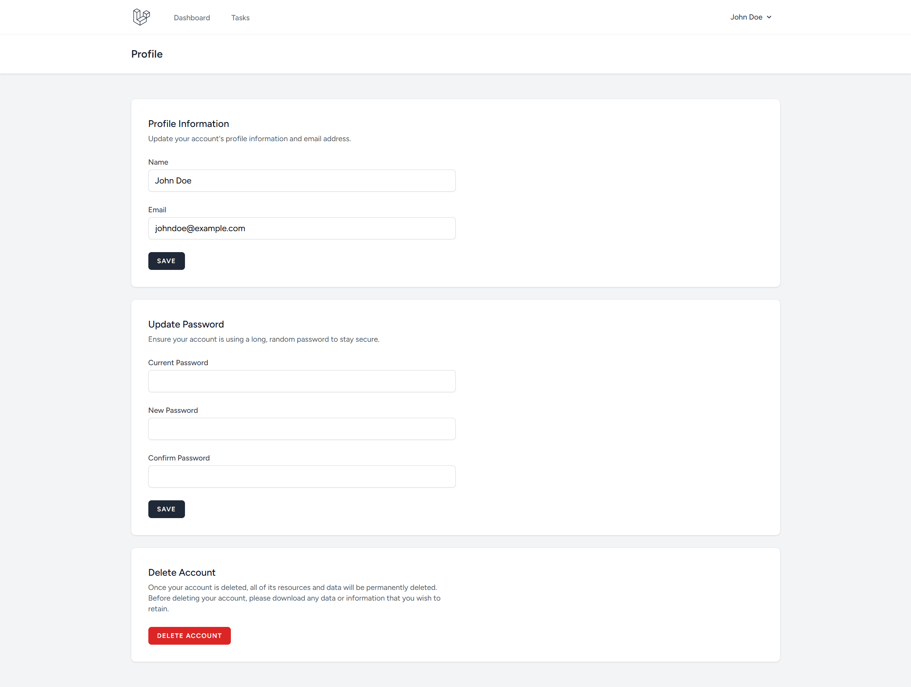

# 📝 Todo App

A full-featured task management application built with **Laravel 12**, **Tailwind CSS**, and **Alpine.js**. Users can register, log in, and manage their personal tasks with priorities, statuses, due dates, search, and filtering capabilities.

---

## Table of Contents

- [Features](#features)
- [Screenshots](#screenshots)
- [Tech Stack](#tech-stack)
- [Project Structure](#project-structure)
- [Prerequisites](#prerequisites)
- [Installation & Setup](#installation--setup)
- [Running the Application](#running-the-application)
- [Database Seeding](#database-seeding)
- [Testing](#testing)
- [License](#license)

---

## Features

- **User Authentication** — Register, login, logout, password reset (powered by Laravel Breeze)
- **Task CRUD** — Create, read, update, and delete tasks
- **Task Priorities** — Low (green), Medium (yellow), High (red)
- **Task Statuses** — Pending (gray), In Progress (blue), Completed (green)
- **Due Dates** — Optional due date with date picker
- **Search** — Search tasks by title or description
- **Filters** — Filter tasks by priority, status, and due date
- **Dashboard** — Task statistics widget showing total, pending, in-progress, and completed counts
- **Authorization** — Users can only manage their own tasks (enforced via policies)
- **Profile Management** — Update name, email, password, or delete account

---

## Screenshots

### Authentication Pages

<p><strong>Login</strong></p>


<p><strong>Register</strong></p>


<p><strong>Forgot Password</strong></p>


<p><strong>Reset Password</strong></p>


### Main Application Pages

<p><strong>Dashboard</strong></p>


<p><strong>Task List</strong></p>


<p><strong>Create Task</strong></p>


<p><strong>Edit Task</strong></p>


### Profile Pages

<p><strong>Edit Profile</strong></p>


---

## Tech Stack

| Layer          | Technology            |
| -------------- | --------------------- |
| Framework      | Laravel 12            |
| Language       | PHP 8.2+              |
| Frontend       | Blade, Tailwind CSS 3 |
| Build Tool     | Vite 7                |
| Authentication | Laravel Breeze        |
| Database       | MySQL                 |
| Code Style     | Laravel Pint          |

---

## Project Structure

```
todo-app/
├── app/
│   ├── Contracts/
│   │   └── RepositoryInterface.php      # CRUD contract for repositories
│   ├── Enums/
│   │   ├── PriorityEnum.php             # Low, Medium, High
│   │   └── StatusEnum.php               # Pending, In Progress, Completed
│   ├── Http/
│   │   ├── Controllers/
│   │   │   ├── TaskController.php       # Task CRUD (index, create, store, edit, update, destroy)
│   │   │   ├── ProfileController.php    # Profile management
│   │   │   └── Auth/                    # Authentication controllers (Breeze)
│   │   └── Requests/
│   │       ├── Tasks/
│   │       │   ├── StoreTaskRequest.php     # Validation for creating tasks
│   │       │   └── UpdateTaskRequest.php    # Validation for updating tasks
│   │       └── ProfileUpdateRequest.php
│   ├── Models/
│   │   ├── Task.php                     # Task model (fillable, casts, relationships)
│   │   └── User.php                     # User model
│   ├── Policies/
│   │   └── TaskPolicy.php              # Authorization: users manage only own tasks
│   ├── Providers/
│   │   └── AppServiceProvider.php      # Binds TaskRepository to service container
│   ├── Repositories/
│   │   ├── BaseRepository.php          # Generic CRUD repository
│   │   ├── TaskRepository.php          # Task-specific queries (search, filters)
│   │   └── UserRepository.php          # User repository
│   ├── Services/
│   │   └── TaskService.php             # Business logic (stats, CRUD operations)
│   └── View/
│       └── Components/
│           ├── AppLayout.php           # Main layout component
│           ├── GuestLayout.php         # Guest layout component
│           └── TaskWidget.php          # Dashboard task statistics widget
├── database/
│   ├── factories/
│   │   └── UserFactory.php
│   ├── migrations/
│   │   ├── 0001_01_01_000000_create_users_table.php
│   │   ├── 0001_01_01_000001_create_cache_table.php
│   │   ├── 0001_01_01_000002_create_jobs_table.php
│   │   └── 2026_03_04_211233_create_tasks_table.php
│   │   └── 2026_03_06_224344_create_password_reset_tokens_table.php
│   └── seeders/
│       ├── DatabaseSeeder.php          # Calls UserSeeder & TaskSeeder
│       ├── UserSeeder.php              # 3 test users
│       └── TaskSeeder.php              # Sample tasks per user
├── resources/
│   ├── css/
│   │   └── app.css                     # Tailwind CSS entry
│   ├── js/
│   │   ├── app.js                      # Alpine.js entry
│   │   └── bootstrap.js
│   └── views/
│       ├── dashboard.blade.php         # Dashboard with task widget
│       ├── layouts/
│       │   ├── app.blade.php           # Authenticated layout
│       │   ├── guest.blade.php         # Guest layout
│       │   └── navigation.blade.php    # Navigation bar
│       ├── tasks/
│       │   ├── index.blade.php         # Task list with search & filters
│       │   ├── create.blade.php        # Create task form
│       │   └── edit.blade.php          # Edit task form
│       ├── profile/
│       │   ├── edit.blade.php          # Profile page
│       │   └── partials/              # Profile sub-forms
│       ├── auth/                       # Login, register, password reset, etc.
│       └── components/                 # Reusable Blade components
├── routes/
│   ├── web.php                         # Application routes
│   ├── auth.php                        # Authentication routes
│   └── console.php                     # Console commands
├── tests/
│   ├── Feature/                        # Feature tests
│   └── Unit/                           # Unit tests
├── composer.json
├── package.json
├── vite.config.js
├── tailwind.config.js
└── phpunit.xml
```

### Architecture Overview

The application follows the **Repository-Service Pattern**:

1. **Controllers** receive HTTP requests and delegate to Services
2. **Services** contain business logic and call Repositories
3. **Repositories** handle database queries (extend `BaseRepository` which implements `RepositoryInterface`)
4. **Policies** enforce authorization rules
5. **Form Requests** handle input validation

---

## Prerequisites

- **PHP** >= 8.2
- **Composer** >= 2.x
- **Node.js** >= 18.x and **npm**
- **MySQL** >= 8.0 (or MariaDB)

---

## Installation & Setup

### 1. Clone the repository

```bash
git clone <repository-url> todo-app
cd todo-app
```

### 2. Install PHP dependencies

```bash
composer install
```

### 3. Install Node.js dependencies

```bash
npm install
```

### 4. Environment configuration

```bash
cp .env.example .env
```

Edit the `.env` file and configure your database connection:

```dotenv
DB_CONNECTION=mysql
DB_HOST=127.0.0.1
DB_PORT=3306
DB_DATABASE=todo_app
DB_USERNAME=root
DB_PASSWORD=your_password
```

### 5. Generate application key

```bash
php artisan key:generate
```

### 6. Create the database

Create a MySQL database named `todo_app` (or whatever you set in `.env`):

```sql
CREATE DATABASE todo_app;
```

### 7. Run migrations

```bash
php artisan migrate
```

### 8. (Optional) Seed the database

```bash
php artisan db:seed
```

This creates 3 test users with sample tasks:

| Name        | Email                  | Password      |
| ----------- | ---------------------- | ------------- |
| John Doe    | johndoe@example.com    | johndoe123    |
| Jane Doe    | janedoe@example.com    | janedoe123    |
| Alice Smith | alicesmith@example.com | alicesmith123 |

### 9. Build frontend assets

```bash
npm run build
```

---

## Running the Application

### Development mode (with hot reload)

Start the Laravel development server and Vite dev server in separate terminals:

```bash
# Terminal 1 — Laravel server
php artisan serve

# Terminal 2 — Vite dev server (hot reload for CSS/JS)
npm run dev
```

The application will be available at **http://localhost:8000**.

### Production

```bash
npm run build
php artisan serve
```

---

## Database Seeding

Reset and re-seed the database at any time:

```bash
php artisan migrate:fresh --seed
```

### Task Schema

| Column        | Type         | Description                                                |
| ------------- | ------------ | ---------------------------------------------------------- |
| `id`          | BIGINT       | Primary key                                                |
| `user_id`     | BIGINT       | Foreign key to `users` table                               |
| `title`       | VARCHAR(255) | Task title (required)                                      |
| `description` | TEXT         | Task description (optional)                                |
| `priority`    | ENUM         | `low`, `medium`, `high` (default: `medium`)                |
| `status`      | ENUM         | `pending`, `in_progress`, `completed` (default: `pending`) |
| `due_date`    | DATE         | Optional due date                                          |
| `created_at`  | TIMESTAMP    | Auto-managed                                               |
| `updated_at`  | TIMESTAMP    | Auto-managed                                               |

---

## Testing

Run the test suite with:

```bash
php artisan test
```

Or using PHPUnit directly:

```bash
./vendor/bin/phpunit
```

---

## License

This project is open-sourced software licensed under the [MIT license](https://opensource.org/licenses/MIT).
